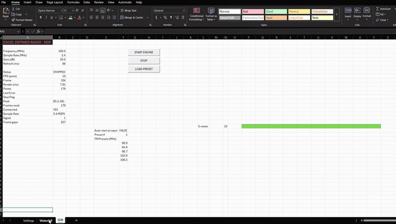

# Excel Defined Radio (XDR)

> The world's first SDR application where the waterfall is rendered using spreadsheet cells.

**Motto:** *Because GNU Radio was too mainstream.*

**Official Support Statement:** No support will be provided. The existence of this software should not be interpreted as an endorsement of Excel as a radio platform.

**To future engineers:** We're sorry.

---

## What is this?

A functional software-defined radio where **Excel is the front end and the engine**. Python is a dumb peripheral that writes files; Excel reads them, paints a waterfall out of cell colors, and tells Python what to tune via a command file. No ports. No services. No firewall prompts. A custom binary protocol whose only consumer is a spreadsheet.

## Features

- **Live FM broadcast audio** — tune a real station from a spreadsheet cell (e.g. `B3 = 102.9`) and listen. Yes, really.
- **Waterfall in cells** — a 128×64 pixel display where every pixel is an Excel cell, colored by conditional formatting.
- **Real hardware** — RTL-SDR V3/V4 (Rafael Micro R828D) via pyrtlsdr. Airspy R2 / SDRPlay via SoapySDR (optional).
- **One-click start** — START ENGINE / STOP / STEP buttons on the SDR sheet. No Alt-F11, no macros manually run, no console.
- **Demo mode** — no dongle? `samples/gen_iq.py` makes a deterministic synthetic FM IQ file for a hardware-free waterfall.
- **Diagnostics tab** — receipts from day one.

## Quick start

1. Install Excel (any modern version).
2. `uv sync` in `/python` (or `pip install -r requirements.txt`).
3. Plug in an RTL-SDR (or run the demo with `samples/gen_iq.py`).
4. Open `excel/XDR.xlsm` → **Enable Content**.
5. Click **START ENGINE** → the waterfall comes alive.
6. Set `B3` to an FM frequency (try 102.9) → audio.

## Bleeding Edge Technology

We don't just push boundaries — we **redefine the definition of them**. This is a stack so advanced it was abandoned by the industry, resurrected by us, and weaponized against common sense.

- **VBA (Visual Basic for Applications)** — the undisputed backbone of enterprise civilization since 1993. We write our signal-processing front end in the same language that powers your finance department's macros. When Excel macros went out of fashion, they went **out of fashion** — we brought them back with a vengeance.
- **Excel cells as pixels** — why bother with a GPU, a display server, or pixels when you have **conditional formatting**? Our 128×64 waterfall is rendered by the same technology that makes your quarterly reports pop. Each cell is a pixel. Each pixel is a cell. It's the most efficient use of a spreadsheet grid ever devised, and by "efficient" we mean "absurd."
- **File-piping as IPC** — sockets? Named pipes? Shared memory? **Obsolete.** Our two processes communicate by **writing fixed-layout binary files into a directory and staring at them until they change.** It's the network stack of the future, minus the network. Zero ports open, zero services listening, zero firewall prompts — the enemy can't hack a file that's just sitting there, waiting. It's the ultimate air-gapped communication protocol, brutal in its simplicity and terrifying in its implications.
- **Python as a dumb peripheral** — a language with numpy, FFT libraries, and a thriving ecosystem, relegated to the job of a **printer driver**: write bytes to a file, repeat forever. It's a peripheral pretending to be a program, and it *knows* it. Somewhere, a software engineer is crying.
- **No GPU, no FPGA, no DSP accelerator** — who needs a 4090 when you have a 128×64 grid of **RGB-interpolated conditional formatting rules** churning out a live FFT waterfall at 15 frames per second?

This is either the most over-engineered joke in radio history or the most under-engineered miracle. We're not sure either. **You shouldn't be either.**

## IPC (the cursed part)

Two fixed-layout binary files in a project-local `xdr_data/` dir:

- `frames.bin` — Python → Excel. 128-bin FFT frames, ~4–30 fps, overwritten in place (552-byte XDR1 records).
- `cmd.bin` — Excel → Python. Tune / sample-rate / gain / refresh commands (16-byte XDRCMD).

## Project laws

1. Excel is the front end **and** the engine. If it doesn't happen in a workbook, it doesn't happen at all.
2. A stranger can run it. One clone, one sync, one `.xlsm`, zero admin.
3. Every phase is a shippable joke increment with a testable exit gate.
4. Keep the receipts — Diagnostics tab from day one.

## Roadmap

Probably nothing.

## License

See `LICENSE` (GPL-2.0-or-later). Spoiler: "No support will be provided."

---

###### Third-party software

See [`THIRD-PARTY-NOTICES.md`](THIRD-PARTY-NOTICES.md) (and `licenses/`) for
the required credits & license texts. In brief: **RTL-SDR Blog drivers**
`bin/rtl-sdr-blog/*` — GPL-2.0 (rtlsdrblog/rtl-sdr-blog); **Osmocom librtlsdr**
`python/rtlsdr_libs/librtlsdr.dll` — GPL-2.0 (osmocom/rtl-sdr); **pyrtlsdr**
— GPL-3.0-or-later; **pyrtlsdrlib** — MIT.